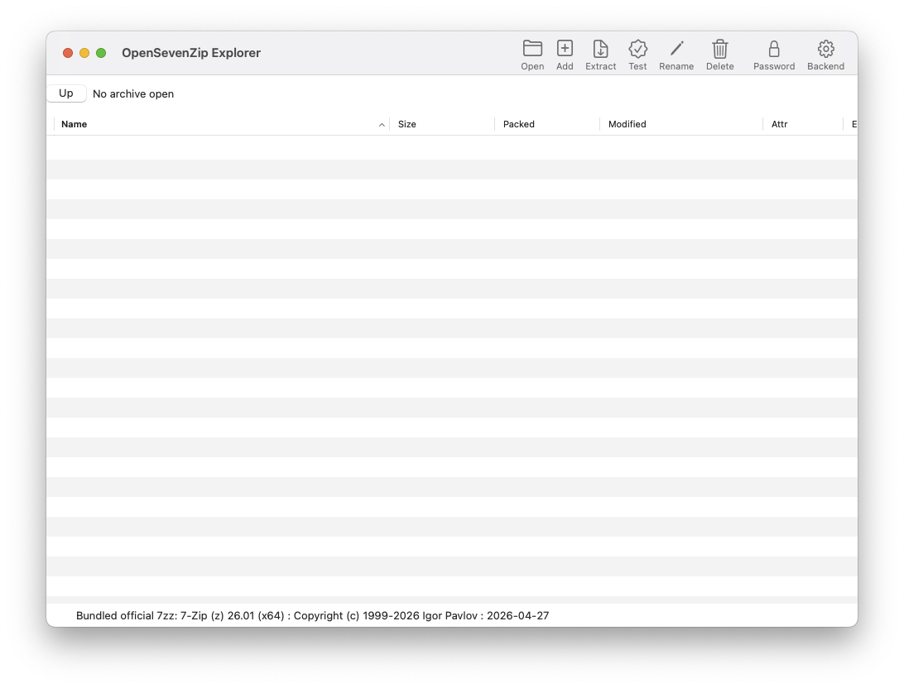

# OpenSevenZip Explorer

> [!CAUTION]
> This project is in very early development. Expect breaking changes, bugs, and incomplete features. Do not use in production.

This is a vibe coding attempt to port the [7-Zip](https://7-zip.org/) File Manager for Windows experience to macOS. It is a native macOS/[AppKit](https://developer.apple.com/documentation/appkit) GUI for 7-Zip archive workflows, not a mature product.

The app shares one Swift source tree and has two distribution builds:

- [Mac App Store](https://developer.apple.com/app-store/)/[TestFlight](https://developer.apple.com/testflight/) build: sandboxed, bundled official `7zz` only.
- GitHub build: bundled `7zz`, PATH-discovered host `7z` family tools, and user-imported temporary executable support.

OpenSevenZip Explorer is an independent macOS application and is not the official [7-Zip File Manager](https://7-zip.org/).

## Screenshot



## Build

```bash
make build-backend-universal
make package-github
make dmg-github
make package-appstore
```

`make build-backend-universal` builds official [7-Zip](https://7-zip.org/) `Alone2` for `x86_64` and `arm64`, combines both slices with `lipo`, and writes the generated universal backend to `Resources/7zz`. The binary is ignored by git and bundled into the app during packaging.

`make fetch-official-backend` downloads the pinned official 7-Zip macOS release archive from [`ip7z/7zip`](https://github.com/ip7z/7zip/releases), verifies the archive SHA-256, verifies the extracted `7zz` SHA-256, and writes `Resources/7zz`. If a local `Resources/7zz` already exists and matches the pinned binary hash, the target skips the download.

Packaged app bundles embed the backend helper at `Contents/MacOS/7zz`.

`make dmg-github` depends on `make fetch-official-backend`, writes `dist/OpenSevenZip-Explorer-gh.dmg`, and requires the bundled helper to be present in `dist/OpenSevenZip Explorer-gh.app/Contents/MacOS/7zz`.

`make build` is an alias for the GitHub build. Both release package targets build a universal Swift app by default.

## Test

```bash
make test
make test-appstore
```

The self-test target runs parser, backend command-construction, backend-priority, and smoke-argument checks without requiring XCTest. GUI smoke reports can be run from the built app with `--gui-smoke-report`, optionally combined with `--gui-smoke-archive`, `--gui-smoke-navigate`, and `--gui-smoke-password`.

## Run

```bash
make run
```

The GitHub app bundle is written to:

```text
dist/OpenSevenZip Explorer-gh.app
```

You can also open an archive directly:

```bash
open "dist/OpenSevenZip Explorer-gh.app" --args /path/to/archive.7z
```

The App Store/TestFlight build is written to `dist/OpenSevenZip Explorer.app`.

## Current Features

- Open archives from the app, Finder/Open With, or a launch argument.
- Open an archive and list entries using `7z l -slt`.
- Navigate folders inside archives, and use Up at archive root to browse the archive's parent folder.
- Sort archive and folder listings by clicking table column headers.
- Use table context menus and keyboard shortcuts for common open, extract, rename, delete, test, password, and backend actions.
- Drag files onto an open archive to add them, or drag an archive/folder into the listing to open it.
- Add files/folders to a new archive.
- Configure add format/compression/password options when creating an archive.
- Configure split-volume sizes plus include/exclude patterns when creating an archive.
- Extract selected entries or the whole archive with overwrite, password, and reveal-destination options.
- Cancel long-running list, add, extract, test, delete, rename, and preview operations.
- Show live backend output in the status bar while operations run.
- Test archive integrity.
- Delete selected archive entries where the backend supports it.
- Rename a selected archive entry where the backend supports it.
- Password prompts for listing, extracting, testing, and creating encrypted archives.
- GitHub build backend settings with bundled, host, and temporary executable candidates.
- App Store/TestFlight build backend settings with bundled backend status and policy notice.
- Licenses and attribution available from the Help menu and bundled notice file.

## Acknowledgements

Thanks to Igor Pavlov and the [7-Zip](https://7-zip.org/) contributors for 7-Zip, and to the [p7zip](https://github.com/p7zip-project/p7zip)/7-Zip tooling ecosystem that this app can interoperate with. [OpenAI Codex](https://openai.com/codex/) was used as an AI coding assistant during development of this project. OpenSevenZip Explorer remains an independent project and is not endorsed by 7-Zip, p7zip, OpenAI, or Codex.

## Distribution Notes

- App Store/TestFlight builds compile with `APP_STORE` and remove arbitrary external executable support at compile time.
- GitHub builds keep external backend support and should be [Developer ID](https://developer.apple.com/developer-id/) signed, hardened-runtime enabled, [notarized](https://developer.apple.com/documentation/security/notarizing-macos-software-before-distribution), and stapled before public release.
- App Store/TestFlight builds require App Store signing/provisioning, sandbox validation, [App Store Connect](https://appstoreconnect.apple.com/) metadata, beta review, and encryption export compliance answers before publication.
